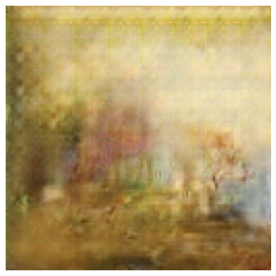

# GAN-Gallery

## Motivation
My dad has a very deep knowledge and understaning of art. He loves art, he reads about art and he can talk art to fancily-dressed people who all sound very intelligent.
When I was younger, my dad used to take me to art museums and I really really did not like it. I didn't like it because most paintings seemd boring and 
did not elicit any emotion in me and so I dimissed them. However, some paintings (and painters) left a long-lasting impression on me. For example Aivazovsky or Vereschagin.
Some paintings just seem to click with whatever is going on inside of your mind.

In recent years, as I learned more and more about ML, I rememberred that feeling that I used to get when seeing paintings like the "Ninth Wave" or the "Apotheosis of War"
and decided to try building my own art generator network. 

However, my network has a bit of a catch! I want it to be able to take text and create art that would match that text. Even more so, I want to create an e-gallery, 
where anyone can generate art based off of a textual description of their emotions and those will be shared with the entire community. There are many other ideas I want to implement
but I won't disclose them all here, you will see them once it's done!

## Progress
Unfortunately, progress has been a bit slow as I am working on many things. So far I have been able to generatae one painting with the text context of `"forest"` and if one
uses their creativity, there's a forest somewhere in there. Right now I am working on a few other things (including improving my skills in ML and working with images) so 
hopefuully very soon you will see updates! 

